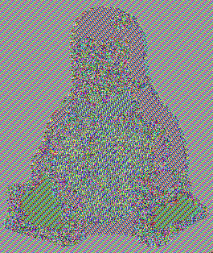
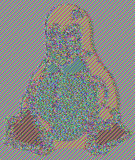
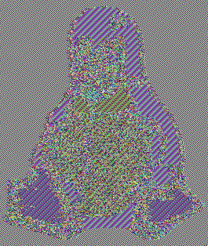

# ecb-penguin
[How AES diffusion (permutation) does not impact ECB penguin pattern with in each block?](https://crypto.stackexchange.com/questions/102107/how-aes-diffusion-permutation-does-not-impact-ecb-penguin-pattern-with-in-each)

Click on above link for answer.

### First convert the Tux to PPM with Gimp
Install [Gimp](https://www.gimp.org/downloads/) > Open `Tux-original.png` image and export as `ppm` in raw format.

### Take header apart
`head -n 4 Tux-raw.ppm > header-raw.txt`

### Take body apart
`tail -n +5 Tux-raw.ppm > body-raw.bin`

### Then encrypt with ECB (experiment with some different keys)
`openssl enc -aes-128-ecb -nosalt -pass pass:"ANNA" -in body-raw.bin -out body-raw-128.ecb.bin`

`openssl enc -aes-192-ecb -nosalt -pass pass:"ANNA" -in body-raw.bin -out body-raw-192.ecb.bin`

`openssl enc -aes-256-ecb -nosalt -pass pass:"ANNA" -in body-raw.bin -out body-raw-256.ecb.bin`

### And finally put the result together and convert to some better format with Gimp

`cat header-raw.txt body-raw-128.ecb.bin > Tux-raw-128.ecb.ppm`

`cat header-raw.txt body-raw-192.ecb.bin > Tux-raw-192.ecb.ppm`

`cat header-raw.txt body-raw-256.ecb.bin > Tux-raw-256.ecb.ppm`

### Tux-raw-128.ecb.png

### Tux-raw-192.ecb.png

### Tux-raw-256.ecb.png

### References
The steps to create a ecb penguin is available https://words.filippo.io/the-ecb-penguin/
https://crypto.stackexchange.com/questions/102107/how-aes-diffusion-permutation-does-not-impact-ecb-penguin-pattern-with-in-each

